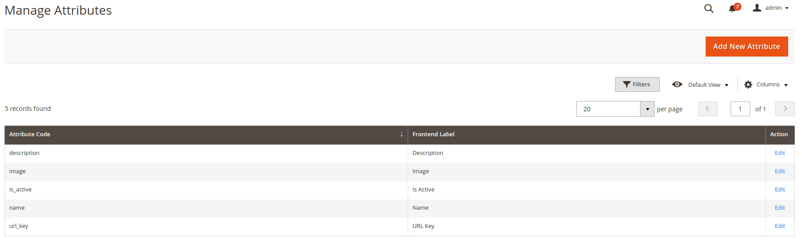
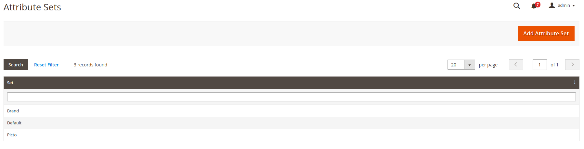
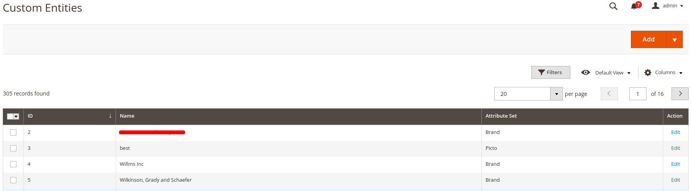
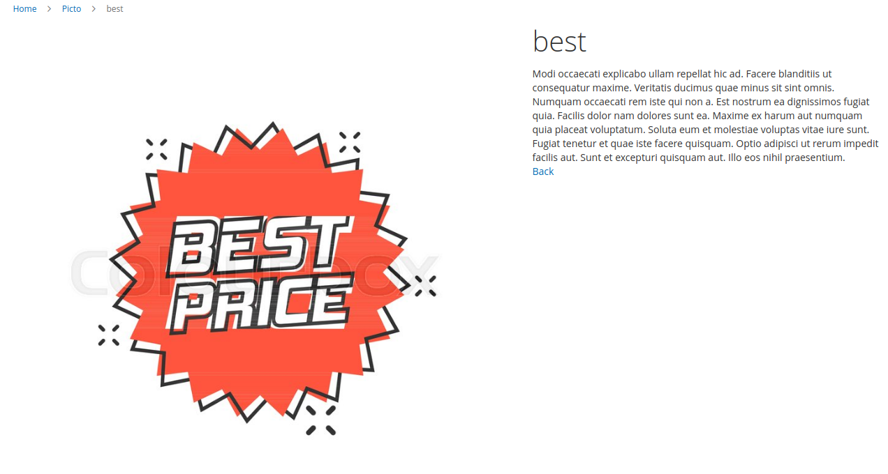

Custom Entity Management
========================

## What is Custom Entity Magento 2 Module?

This module allow possibility to create and manage custom enities like Brand, Pictogram, ... and  to display them in front  

## Who is developing this module ? 

This module is built by Smile. 

Smile is the **European leader of Open Source** and also a four-times **Europe Partner of the the Year** (2010-2014), two-times **Spirit of Excellence** (2015-2016), **Global Elite Partner** (2017-now), and **Regional Commercial Partner** (2018) awarded by Magento.

Our multidisciplinary team brings together experts in technology, innovation, and new applications.

Together we explore, invent, and test technologies of the future, to better serve our clients.

## Main Features

### Create Entity Attribute, Entity Type and Entity

* **Entity Attributes:**

This module allows you to **create entity attribute** like the product attributes.

* **Entity type:**

You can create as many entity types as you need

* **Entity:**

Create your entities:

### Entity type and Entity on front

* **Display your entity set and your entities**

## Documentation

Documentation is available [here](https://github.com/Smile-SA/magento2-module-custom-entity/wiki).

The User Guide is also available on PDF format [here](https://github.com/Smile-SA/magento2-module-custom-entity/wiki/static/UserGuide.pdf)

## Contributing

You can contribute to this module by submitting issues or pull requests.

For more details, please take a look at the [contribution guidelines](CONTRIBUTING.md).

## Changelog

All notable changes are recorded in this [changelog](CHANGELOG.md).

## Standards & Code Quality

[Smile Lab Quality Suite (Magento)](https://github.com/Smile-SA/magento2-smilelab-quality-suite/) provides coding standards / rulesets that can be used on Magento projects.
